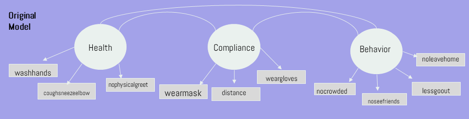
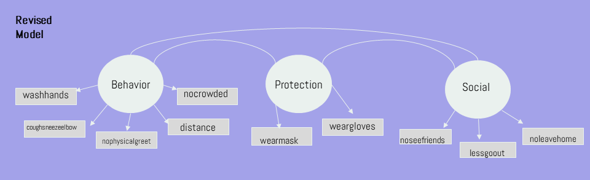

```{r setup, include=FALSE}
knitr::opts_chunk$set(echo = TRUE)
```

```{r load-packages, echo=TRUE, results='hide', message=FALSE, warning=FALSE}

library(tidyverse)
library(haven)
library(psych)
library(lm.beta)
library(GPArotation)
library(lavaan)
library(yarrr)

```


# Research Questions

1) Those who practice better behavior, protection, and social habits will agree with COVID guidelines more than those that do not.

2) Those who practice worse behavior, protection, and social habits will be less compliant with COVID guidelines than those who practice better habits.

3) Women will practice better behavior, protection, and social habits compared to men.

4) People in their 70s will practice better behavior, protection, and social habits compared to people in their 20s.

5) New Zealand will practice better behavior, protection, and social habits compared to Italy.

# Dataset

The data was acquired from the study Attitudes on COVID-19: A Comparative Study, which focused on gender and attitudes and behaviors surrounding the COVID-19 pandemic. This study was performed by the National Bureau of Economic Research and collected data from 8 countries - the United States, Italy, New Zealand, Australia, Germany, Austria, France, and the United Kingdom. The data was collected in March and April 2020.

We chose to look at data from Italy and New Zealand and read in the data for both of these countries. For each country, we selected the variables that related to our research questions. After binding the rows, we created an age variable to identify if each participant was in their 20s, 70s, or other. Participants were omitted if they indicated an age group other than 20s or 70s.

The total sample (n = 1073) included 556 Italians and 517 New Zealanders. Of the total sample, 564 were in their 20s and 509 were in their 70s, and 543 identified as Male and 530 identified as Female.

Observations with missing data for any of the items within our factors for EFA, Reliability, and CFA, leaving a sample size of 565.

```{r results='hide'}

ITA_data <- read_dta("COVIDsurvey_ITApanel.dta")

NZ_data <- read_dta("COVIDsurvey_NZpanel.dta")

Italy <- ITA_data %>%
  select(id, country, wid, female, twenties, seventies,
         washhands, coughsneezeelbow, nophysicalgreet,
         wearmask, distance, weargloves,
         nocrowded, noseefriends, lessgoout, noleavehome,
         overall_compliance, overall_agree,
         contactcovid, covid)

NZ <- NZ_data %>%
  select(id, country, wid, female, twenties, seventies,
         washhands, coughsneezeelbow, nophysicalgreet,
         wearmask, distance, weargloves,
         nocrowded, noseefriends, lessgoout, noleavehome,
         overall_compliance, overall_agree,
         contactcovid, covid)

covid <- bind_rows(Italy, NZ) %>%
  mutate(age = ifelse(twenties == 1, "twenties", 
               ifelse(seventies == 1, "seventies", "other"))
  ) %>%
  select(-(twenties), -(seventies)) %>%
  filter(age != "other")

nrow(covid[covid$country == "Italy",])
nrow(covid[covid$country == "NZ",])

nrow(covid[covid$age == "twenties",])
nrow(covid[covid$age == "seventies",])

nrow(covid[covid$female == 1,])
nrow(covid[covid$female == 0,])

covid_omit <- covid %>%
  na.omit()

nrow(covid_omit[covid_omit$country == "Italy",])
nrow(covid_omit[covid_omit$country == "NZ",])

```


# Lay Audience Visualations - COVID positive and COVID contact

The following visualizations were created for a lay audience. These plots provide some context as to the percentage of participants in each group that either tested positive for COVID-19 or came into close contact with an individual who tested positive for COVID-19. 

The first bar chart shows the percentages of those in Italy vs. New Zealand.

```{r, message=FALSE, warning=FALSE}

vis <- covid_omit %>%
  select(country, female, age, contactcovid, covid) %>%
  rename(gender = female) %>%
  mutate(gender = ifelse(gender == 1, "female", "male"))

percent_covid <- vis %>%
  group_by(country) %>%
  summarize(perc_covid = sum(covid) / length(country))

percent_contact <- vis %>%
  group_by(country) %>%
  summarize(perc_contact = sum(contactcovid) / length(country))

context <- full_join(percent_contact, percent_covid, by = "country") %>%
  rename(contact = perc_contact,
         covid = perc_covid) %>%
  pivot_longer(2:3, names_to = "status", values_to = "percent")

ggplot(context, aes(status, percent, fill = country)) +
  geom_bar(stat = "identity", position = "dodge")


```

The second bar chart shows the percentages of those in their 20s vs 70s.

```{r, message=FALSE, warning=FALSE}

age_perc_covid <- vis %>%
  group_by(age) %>%
  summarize(perc_covid = sum(covid) / length(age))

age_perc_contact <- vis %>%
  group_by(age) %>%
  summarize(perc_contact = sum(contactcovid) / length(age))

age_context <- full_join(age_perc_contact, age_perc_covid, by = "age") %>%
  rename(contact = perc_contact,
         covid = perc_covid) %>%
  pivot_longer(2:3, names_to = "status", values_to = "percent")

ggplot(age_context, aes(status, percent, fill = age)) +
  geom_bar(stat = "identity", position = "dodge")

```

The third bar chart shows the percentages of males vs females.

```{r, message=FALSE, warning=FALSE}

gender_perc_covid <- vis %>%
  group_by(gender) %>%
  summarize(perc_covid = sum(covid) / length(gender))

gender_perc_contact <- vis %>%
  group_by(gender) %>%
  summarize(perc_contact = sum(contactcovid) / length(gender))

gender_context <- full_join(gender_perc_contact, gender_perc_covid, by = "gender") %>%
  rename(contact = perc_contact,
         covid = perc_covid) %>%
  pivot_longer(2:3, names_to = "status", values_to = "percent")

ggplot(gender_context, aes(status, percent, fill = gender)) +
  geom_bar(stat = "identity", position = "dodge")

```


# Original Model



For our original model, we chose variables from the COVID data set that were on the same continuous scale. For each item, participants were asked: 

Due to the coronavirus epidemic, in your daily life, would you say that... (insert variable)
all are on scale of 0 (not at all) - 10 (completely)

Data was then normalized by the original authors on a 0 - 1 range.

Our original model was a three factor model with the following items:

**Health:** 

- washhands: You are washing your hands more often and/or for a longer amount of time
- coughsneezeelbow: You are coughing or sneezing into your elbow or a tissue
- nophysicalgreet: You have stopped greeting others by shaking hands, hugging or kissing

**Compliance:**

- wearmask: You wear a mask or protection over your nose and mouth when you are outside your home
- distance: You keep a distance of six feet between yourself and other people outside your home
- weargloves: You wear gloves when you are outside your home

**Behavior: **

- nocrowded: You avoid busy places (public transportation, restaurants, sports...)
- noseefriends: You have stopped seeing friends
- lessgoout: You have reduced your trips outside of home
- noleavehome: You leave your home less than once a day on average


# Inter-item correlations - original model

We created pairs panels to visualize the correlation between items within the same factors along with the factor mean.

```{r}

health_mean <- covid %>%
  select(washhands, coughsneezeelbow, nophysicalgreet) %>%
  mutate(mean_health = (washhands + coughsneezeelbow + nophysicalgreet) / 3)

pairs.panels(health_mean,
             ellipses = FALSE,
             jiggle = TRUE)


compliance_mean <- covid %>%
  select(wearmask, distance, weargloves) %>%
  mutate(mean_compliance = (wearmask + distance + weargloves) / 3)

pairs.panels(compliance_mean,
             ellipses = FALSE,
             jiggle = TRUE)


behavior_mean <- covid %>%
  select(nocrowded, noseefriends, lessgoout, noleavehome) %>%
  mutate(mean_behavior = (nocrowded + noseefriends + lessgoout + noleavehome) / 4)

pairs.panels(behavior_mean,
             ellipses = FALSE,
             jiggle = TRUE)

```


# Exploratory Factor Analysis

To conduct an EFA, we used the covid_omit dataframe we created which omitted any observation that was missing data for any of the items in our 3-factor model. 

The scree plot indicated that this data may be fit best by a 3 or 4 factor model, as this is where plot began to level out/showed less change in eigenvalues. The map criterion indicated that perhaps the data is best fit by a 2 factor model as the point of inflection was at 2 which a big change to the 3rd factor. 

We decided to test both 2-factor and 3-factor models. Splitting the 10 items across 4 factors would require several factors to only have 2 items, which is not ideal. 

```{r}

covid_efa <- covid_omit %>%
  select(washhands, coughsneezeelbow, nophysicalgreet,
         wearmask, distance, weargloves,
         nocrowded, noseefriends, lessgoout, noleavehome)

scree(covid_efa)

vss(covid_efa)

```

The results of the EFA indicated that the items loaded onto 3 factors differently than our original model would suggest. 

- MR1 - washhands, coughsneezeelbow, nophysicalgreet, distance, nocrowded
- MR2 - wearmask, weargloves
- MR3 - noseefriends, lessgoout, noleavehome

```{r}

covid_fa_oblique <- fa(covid_efa, nfactors = 3, fm = "minres", rotate = "oblimin")
covid_fa_oblique

```

The results of the EFA indicated that the items loaded onto the 2 factors as follows: 

- MR1 - washhands, coughsneezeelbow, nophysicalgreet, distance, nocrowded, 
      noseefriends, lessgoutout, noleavehome
- MR2 - wearmask, weargloves

```{r}

covid_fa_oblique_2 <- fa(covid_efa, nfactors = 2, fm = "minres", rotate = "oblimin")
covid_fa_oblique_2

```


# Revised Model

We revised our original model in accordance with the EFA as follows:



# Reliability

We computed the reliability of items within each factor for both the 2 and 3 factor models. The omega() function was used for factors that had at least 3 items with strong factor loadings. The alpha() function was used for factors that only had 2 items with strong factor loadings. 

Similar to EFA, we used the dataframe that excluded participants with missing data for any of the items. 

We created pairs panels to analyze the correlations between items in each factor for the 2 and 3 factor models.

Reliability indices for each model:

**3-factor model:**  
- Behavior: 0.68  
- Protection: 0.84  
- Social: 0.61  

**2-factor model:**  
- Prevention: 0.76  
- Protection: 0.84  

The reliability values may be slightly stronger for the 2-factor model, but we judge the 3-factor model to be better as the items are more evenly distributed across factors. In the protection factor within each model, the variables wearmask and weargloves are strongly correlated, and always loaded strongly onto the same factor by themselves no matter how many factors.

```{r, message=FALSE, warning=FALSE}

behavior_factor <- covid_efa %>%
  select(washhands, coughsneezeelbow, nophysicalgreet, distance, nocrowded)

pairs.panels(behavior_factor,
             ellipses = FALSE,
             jiggle = TRUE)

omega(behavior_factor)


protection_factor <- covid_efa %>%
  select(wearmask, weargloves)

pairs.panels(protection_factor,
             ellipses = FALSE,
             jiggle = TRUE)

alpha(protection_factor)


social_factor <- covid_efa %>%
  select(noseefriends, lessgoout, noleavehome)

pairs.panels(social_factor,
             ellipses = FALSE,
             jiggle = TRUE)

omega(social_factor)


prevention_factor <- covid_efa %>%
  select(washhands, coughsneezeelbow, nophysicalgreet, distance, 
         nocrowded, noseefriends, lessgoout, noleavehome
  )

pairs.panels(prevention_factor,
             ellipses = FALSE,
             jiggle = TRUE)

omega(prevention_factor)

protection_factor_2 <- covid_efa %>%
  select(wearmask, weargloves)

pairs.panels(protection_factor_2,
             ellipses = FALSE,
             jiggle = TRUE)

alpha(protection_factor_2)

```


# Confirmatory Factor Analysis

We performed CFA for the revised 3-factor model based on the factor loadings from the EFA, as well as the 2-factor model from the EFA. Below are the fit indices for each model. 

**3-factor model**  
- CFI = 0.960  
- RMSEA = 0.050  
- CI = 0.029  
- SRMR = 0.042  
- moderate to high lambda loadings  

**2-factor model**  
- CFI = 0.915  
- RMSEA 0.070  
- CI = 0.025  
- SRMR = 0.050  
- low to moderate lambda loadings  

Change in RMSEA (0.020) from 3 to 2 factor model was close, but not greater than CI (0.014). However, all indices got worse, so we concluded 3 factor model fit data better. The lambda factor loadings were also better for the 3 factor model.

```{r, results = 'hide'}

model <- 
'
behavior =~ washhands + coughsneezeelbow + nophysicalgreet + distance + nocrowded
protection =~ wearmask + weargloves
social =~ noseefriends + lessgoout + noleavehome
'

fit <- cfa(model, data = covid_efa)
summary(fit, fit.measures = TRUE)
lavInspect(fit, what = "std")


model_2 <- 
'
prevention =~ washhands + coughsneezeelbow + nophysicalgreet + distance + nocrowded + noseefriends + lessgoout + noleavehome
protection =~ wearmask + weargloves
'

fit_2 <- cfa(model_2, data = covid_efa)
summary(fit_2, fit.measures = TRUE)
lavInspect(fit_2, what = "std")

```


# Multiple Regression

Using factor means for our multiple regressions is justified as CFA showed our model met the benchmark indices for good fit. 

Overall_agree was captured by a set of self report questions (scaled 0-1). For example, a question for overall_agree was “Do you agree that school should be closed? Do you agree that there should be a curfew?” 

Overall_compliance was captured by a set of self report questions that asked to what extent they followed certain COVID guideline behaviors using a (0-1 scale). An example: “Wash hands, social distance”. 

Multiple regressions were run to see if our revised factors predicted variance in both overall_agree and overall_compliance. We used the covid dataframe to conduct regressions which included participants with missing data. Indicating na.rm = TRUE when computing means allowed us to include participants that had missing data for one or more item, but had data for other items. 

Below are the statistics for each regression:

**Overall compliance:**   
- R-squared = 0.7251  
- Standardized betas:  
- behavior = 0.33  
- protection = 0.57  
- social = 0.32  

**Overall agree:**   
- R-squared = 0.05755  
- Standardized betas:  
- behavior = 0.11  
- protection = 0.06  
- social = 0.17  

We created one scatterplot for each regression showing the relationship between the strongest predictor for overall_agree, Social, and for overall_compliance and Protection.

With overall_agree and mean_social, we got a U-shaped trend. This is an issue as the way we conduct regressions assumes linear trends. We must interpret with caution. A way to mitigate this would be to break up the data - looking at scores with a mean_social above 0.5 as that’s where the line starts to take linear form.

```{r, message=FALSE, warning=FALSE}

overall_compliance <- covid %>%
  rowwise() %>%
  mutate(mean_behavior = mean(washhands, coughsneezeelbow, nophysicalgreet, distance, nocrowded),
         mean_protection = mean(wearmask, weargloves, na.rm = TRUE),
         mean_social = mean(noseefriends, lessgoout, noleavehome, na.rm = TRUE)
  ) %>%
  select(overall_compliance, mean_behavior, mean_protection, mean_social)


compliance_reg <- lm.beta(lm(overall_compliance ~ mean_behavior + mean_protection +
                             mean_social, data = overall_compliance)
)
summary(compliance_reg)

ggplot(overall_compliance, aes(mean_protection, overall_compliance)) +
  geom_point() +
  geom_jitter() +
  geom_smooth()

pairs.panels(overall_compliance,
             ellipses = FALSE,
             jiggle = TRUE)


overall_agree <- covid %>%
  rowwise() %>%
  mutate(mean_behavior = mean(washhands, coughsneezeelbow, nophysicalgreet, distance, nocrowded, na.rm = TRUE),
         mean_protection = mean(wearmask, weargloves, na.rm = TRUE),
         mean_social = mean(noseefriends, lessgoout, noleavehome, na.rm = TRUE)
  ) %>%
  select(overall_agree, mean_behavior, mean_protection, mean_social)


agree_reg <- lm.beta(lm(overall_agree ~ mean_behavior + mean_protection +
                        mean_social, data = overall_agree)
)
summary(agree_reg)

ggplot(overall_agree, aes(mean_social, overall_agree)) +
  geom_point() +
  geom_jitter() +
  geom_smooth()

pairs.panels(overall_agree,
             ellipses = FALSE,
             jiggle = TRUE)


```


# Group Comparisons - Measurement Invariance

Group Comparisons were performed using the covid_omit data that removed participants that had missing data for any of the items. 

## 1) NZ vs Italy

Model is measurement invariant on all levels but strict across countries based on the following CFA indices. 

**Configural Model**  
- CFI = 0.928  
- RMSEA = 0.066 (change by .016, less than largest CI)  
- CI = 0.029  
- SRMR = 0.051  
- moderate (with a few high) lambda factor loadings for NZ  
- moderate to high lambda factor loadings for Italy  

Not a substantial drop in fit from 3-factor CFA model, other indices did not get worse by much.

**Weak Model**  
- CFI = 0.915  
- RMSEA = 0.068 (0.002 change from config model, not larger than 0.029, not a substantial drop in fit)  
- CI = 0.027  
- SRMR = 0.060  
- moderate to high lambda factor loadings for both countries  

Indices relatively close, not a substantial drop in fit from Configural model.

**Strong Model**  
- CFI = 0.902  
- RMSEA = .070 (0.002 change, smaller than 0.027 CI, not a substantial drop in fit)  
- CI = 0.026  
- SRMR = .064  
- moderate to high lambda factor loadings for both countries  

Overall no change in fit from Weak model.

**Strict Model**  
- CFI = 0.655  
- RMSEA = 0.124 (change of 0.054 - substantial drop in fit)  
- CI = 0.022  
- SRMR = 0.100  
- moderate to high lambda factor loadings for both countries  

Changes in indices suggests there is a substantial drop in fit, model is not measurement invariant on the strict level between countries.

```{r, results = 'hide', message=FALSE, warning=FALSE}

country_covid <- covid_omit %>%
  select(country,
         washhands, coughsneezeelbow, nophysicalgreet,
         wearmask, distance, weargloves,
         nocrowded, noseefriends, lessgoout, noleavehome
  )

fit_config_country <- cfa(model,
                          data = country_covid,
                          group = "country"
                      )
summary(fit_config_country, fit.measures = TRUE)
lavInspect(fit_config_country, what = "std")


fit_weak_country <- cfa(model,
                        data = country_covid,
                        group = "country",
                        group.equal = c("loadings")
                    )
summary(fit_weak_country, fit.measures = TRUE)
lavInspect(fit_weak_country, what = "std")


fit_strong_country <- cfa(model,
                          data = country_covid,
                          group = "country",
                          group.equal = c("loadings", "intercepts")
                      )
summary(fit_strong_country, fit.measures = TRUE)
lavInspect(fit_strong_country, what = "std")


fit_strict_country <- cfa(model,
                          data = country_covid,
                          group = "country",
                          group.equal = c("loadings", "intercepts", "residuals")
                      )
summary(fit_strict_country, fit.measures = TRUE)
lavInspect(fit_strict_country, what = "std")

```

We created a pirateplot for an expert audience to visualize the distribution of means for each factor between countries. The bar graph is for a lay audience. 

All three factor means contradict our hypothesis. We originally hypothesized that NZ would be better across all factors. Note that NZ is very low in mean_protection. One reason we think this might be is due to the fact that NZ went on lockdown and thus, maybe following protection guidelines wasn’t necessary. 

```{r, message=FALSE, warning=FALSE}

country_vis <- country_covid %>%
  rowwise() %>%
  mutate(mean_behavior = mean(washhands, coughsneezeelbow, nophysicalgreet, distance, nocrowded),
         mean_protection = mean(wearmask, weargloves),
         mean_social = mean(noseefriends, lessgoout, noleavehome)
  ) 

country_lay <- country_vis %>%
  group_by(country) %>%
  summarize(mean_behavior = mean(mean_behavior),
            mean_protection = mean(mean_protection),
            mean_social = mean(mean_social)
  ) %>%
  pivot_longer(2:4, names_to = "factor", values_to = "mean")

ggplot(country_lay, aes(factor, mean, fill = country)) +
  geom_bar(stat = "identity", position = "dodge")

country_expert <- country_vis %>%
  select(country, mean_behavior, mean_protection, mean_social) %>%
  pivot_longer(2:4, names_to = "factor", values_to = "mean")

pirateplot(mean ~ country + factor, data = country_expert)

```


## 2) Twenties vs Seventies

Model is measurement invariant on all levels but strict across age groups. 

**Configural Model**  
- CFI = 0.947  
- RMSEA = 0.059 (change of 0.009, not a substantial drop in fit)  
- CI = 0.030  
- SRMR = 0.048  
- moderate to high lambda loadings for both age groups  

Configural model does not appear to have a substantial drop in fit compared to 3-factor model based on all indices.

**Weak Model**  
- CFI = 0.941  
- RMSEA = 0.059 (no change)  
- CI = 0.028  
- SRMR = 0.055  
- moderate to high lambda factor loadings for both age groups  

No substantial drop in fit from Configural model.

**Strong Model**  
- CFI = 0.930  
- RMSEA = 0.062 (change of 0.003, smaller than largest CI)  
- CI = 0.027  
- SRMR = 0.059  
- moderate to high lambda factor loadings for both age groups  

Not a substantial drop in fit from Weak model.

**Strict Model**  
- CFI = 0.801  
- RMSEA = 0.098 (change of 0.036, larger than larger CI of 0.027, substantial drop in fit)  
- CI = 0.022  
- SRMR = 0.090  
- moderate to high lambda factor loadings for both age groups  

Substantial drop in fit, model is not measurement invariant on the strict level across age groups.

```{r, results = 'hide', message=FALSE, warning=FALSE}

covid_age <- covid_omit %>%
  select(age,
         washhands, coughsneezeelbow, nophysicalgreet,
         wearmask, distance, weargloves,
         nocrowded, noseefriends, lessgoout, noleavehome
  )
        
fit_config_age <- cfa(model,
                      data = covid_age,
                      group = "age"
                  )
summary(fit_config_age, fit.measures = TRUE)
lavInspect(fit_config_age, what = "std")


fit_weak_age <- cfa(model,
                    data = covid_age,
                    group = "age",
                    group.equal = c("loadings")
                )
summary(fit_weak_age, fit.measures = TRUE)
lavInspect(fit_weak_age, what = "std")


fit_strong_age <- cfa(model,
                      data = covid_age,
                      group = "age",
                      group.equal = c("loadings", "intercepts")
                  )
summary(fit_strong_age, fit.measures = TRUE)
lavInspect(fit_strong_age, what = "std")


fit_strict_age <- cfa(model,
                  data = covid_age,
                  group = "age",
                  group.equal = c("loadings", "intercepts", "residuals")
)
summary(fit_strict_age, fit.measures = TRUE)
lavInspect(fit_strict_age, what = "std")

```

We created a pirateplot for an expert audience to visualize the distribution of means for each factor between age groups. The bar graph is for a lay audience. 

Mean_protection and mean_social contradict our hypothesis, as we hypothesized that people in their 70s would practice better protection and social habits compared to people in their 20s.

```{r, message=FALSE, warning=FALSE}

age_vis <- covid_age %>%
  rowwise() %>%
  mutate(mean_behavior = mean(washhands, coughsneezeelbow, nophysicalgreet, distance, nocrowded),
         mean_protection = mean(wearmask, weargloves),
         mean_social = mean(noseefriends, lessgoout, noleavehome)
  ) 

age_lay <- age_vis %>%
  group_by(age) %>%
  summarize(mean_behavior = mean(mean_behavior),
            mean_protection = mean(mean_protection),
            mean_social = mean(mean_social)
  ) %>%
  pivot_longer(2:4, names_to = "factor", values_to = "mean")

ggplot(age_lay, aes(factor, mean, fill = age)) +
  geom_bar(stat = "identity", position = "dodge")


age_expert <- age_vis %>%
  select(age, mean_behavior, mean_protection, mean_social) %>%
  pivot_longer(2:4, names_to = "factor", values_to = "mean")

pirateplot(mean ~ age + factor, data = age_expert)

```


## 3) Gender

Model is measurement invariant on all levels but strict across genders.

**Configural Model**  
- CFI = 0.957  
- RMSEA = 0.052 (change of 0.002, not a substantial drop in fit)  
- CI = 0.032  
- SRMR = 0.047  
- moderate to high lambda factor loadings across genders  

Not a substantial drop in fit from 3-factor model.

**Weak Model**  
- CFI = 0.956  
- RMSEA = 0.049 (improved change of 0.003)  
- CI = 0.031  
- SRMR = 0.050  
- moderate to high lambda factor loadings across genders  

Not a substantial drop in fit from Configural model, RMSEA is better

**Strong Model**  
- CFI = 0.946  
- RMSEA = 0.052 (change of 0.003, not a substantial drop in fit)  
- CI = 0.028  
- SRMR = 0.054  
- moderate to high lambda factor loadings across genders  

Not a substantial drop in fit from Weak model.

**Strict Model**   
- CFI = 0.892  
- RMSEA = 0.069 (change of 0.017, not larger than 0.028 - larger CI)  
- CI = 0.025  
- SRMR = 0.076  
- moderate to high lambda factor loadings across genders  

Considering all indices, even though change in RMSEA is not greater than CI, model may not be measurement invariant on the strict level across genders.

```{r, results = 'hide', message=FALSE, warning=FALSE}

covid_gender <- covid_omit %>%
  mutate(gender = ifelse(female == 1, "female", "male")
  ) %>%
  select(gender,
         washhands, coughsneezeelbow, nophysicalgreet,
         wearmask, distance, weargloves,
         nocrowded, noseefriends, lessgoout, noleavehome
  )

fit_config_gender <- cfa(model,
                      data = covid_gender,
                      group = "gender"
                  )
summary(fit_config_gender, fit.measures = TRUE)
lavInspect(fit_config_gender, what = "std")


fit_weak_gender <- cfa(model,
                       data = covid_gender,
                       group = "gender",
                       group.equal = c("loadings")
                   )
summary(fit_weak_gender, fit.measures = TRUE)
lavInspect(fit_weak_gender, what = "std")


fit_strong_gender <- cfa(model,
                         data = covid_gender,
                         group = "gender",
                         group.equal = c("loadings", "intercepts")
                     )
summary(fit_strong_gender, fit.measures = TRUE)
lavInspect(fit_strong_gender, what = "std")


fit_strict_gender <- cfa(model,
                         data = covid_gender,
                         group = "gender",
                         group.equal = c("loadings", "intercepts", "residuals")
                     )
summary(fit_strict_gender, fit.measures = TRUE)
lavInspect(fit_strict_gender, what = "std")

```

We created a pirateplot for an expert audience to visualize the distribution of means for each factor between genders. The bar graph is for a lay audience.

Mean_behavior contradicts our hypothesis, as we thought that women would practice better behavior habits compared to men. 

```{r, message=FALSE, warning=FALSE}

gender_vis <- covid_gender %>%
  rowwise() %>%
  mutate(mean_behavior = mean(washhands, coughsneezeelbow, nophysicalgreet, distance, nocrowded),
         mean_protection = mean(wearmask, weargloves),
         mean_social = mean(noseefriends, lessgoout, noleavehome)
  ) 

gender_lay <- gender_vis %>%
  group_by(gender) %>%
  summarize(mean_behavior = mean(mean_behavior),
            mean_protection = mean(mean_protection),
            mean_social = mean(mean_social)
  ) %>%
  pivot_longer(2:4, names_to = "factor", values_to = "mean")

ggplot(gender_lay, aes(factor, mean, fill = gender)) +
  geom_bar(stat = "identity", position = "dodge")

gender_expert <- gender_vis %>%
  select(gender, mean_behavior, mean_protection, mean_social) %>%
  pivot_longer(2:4, names_to = "factor", values_to = "mean")

pirateplot(mean ~ gender + factor, data = gender_expert)

```


# Ethical Reflection

We have looked at articles regarding bias and how that plays a role in data analysis. We thought analyzing our own team bias was important. We both go to W&L, a prestigious, small, liberal arts school. We both are women, belong to two different racial groups, and come from different backgrounds. Our own biases and experiences can influence how we interpret and analyze data, so it is important to acknowledge our backgrounds. Our team was dramatically different from the researchers who collected and analyzed the data, as there was one woman and five men.

To ensure that our results are accessible and understandable to all audiences, we have included visualizations for both the lay person and expert audience. We understand that our team has an extensive background in statistics and data analysis, making lay person explanations and visualizations even more necessary. We will publicize our analyses and findings to ensure they are transparent and accessible. 

To test for fairness with respect to different user groups, our CFA looked at 3 different groups to determine if our model fits. Our model comparisons showed that between the three chosen groups, our model was measurement invariant on all levels except strict. 

Participants provided informed consent upon participating in the original study. All data is de-identified. When analyzing the data, we tried to let it speak for itself and not jump to any concrete conclusions that may harm individuals or groups.


